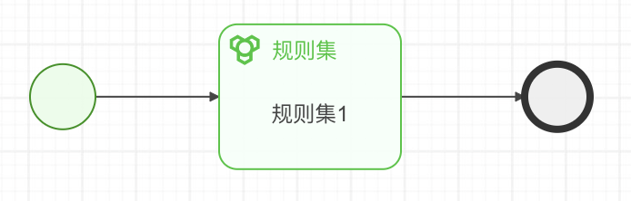
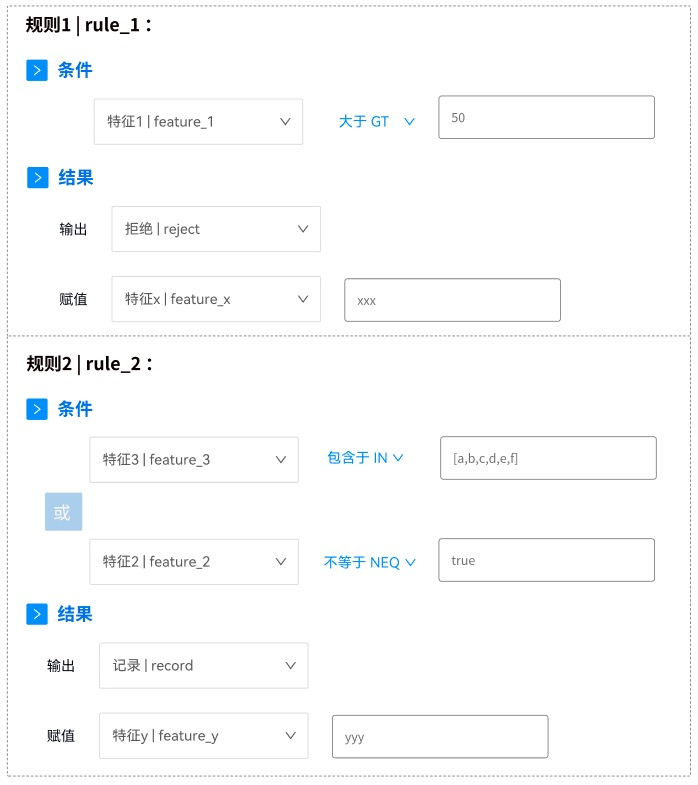

# 决策引擎提供接口 HTTP API
- [字段定义](#字段定义)
- [错误码定义](#错误码定义)
- [获取支持的决策流列表](#决策流列表)
- [执行决策流](#决策流执行)


### 字段定义

| 字段     | 说明                                                                                                   |
| -------- | ------------------------------------------------------------------------------------------------------ |
| key      | 决策流唯一标识 key                                                                                     |
| version  | 决策流版本号                                                                                           |


### 错误码定义

| 错误码 | 说明           |
| ------ | -------------- |
| 200    | 成功           |
| 400   | 请求参数错误   |
| 404   | 决策流不存在   |
| 500   | 未知错误       |

### 决策流列表

*HTTP*

GET http://HOST/engine/list

*请求参数*


*返回结果*

```json
{
	"code": 200,
	"error": "",
	"result": [{
		"key": "flow_ruleset",
		"version": "1.0",
		"md5": "46ef45be94e2f3c1ca23cc4ce9fe8947"
	}, {
		"key": "flow_abtest",
		"version": "1.0",
		"md5": "886ac3943749e9cf27b5033aad84a9b9"
	}, {
		"key": "flow_conditional",
		"version": "1.0",
		"md5": "df7a8a9431e38f1729d8d6788987df23"
	}, {
		"key": "flow_matrix",
		"version": "1.0",
		"md5": "37a47768ccb2b48d8585a16693d2279f"
	}]
}
```

*CURL*
```shell
curl http://localhost:8889/engine/list
```

### 决策流执行

*HTTP*

POST http://HOST/engine/run

*请求参数*

| 参数名   | 必选  | 类型              | 说明                             |
| -------- | ----- | ----------------- | -------------------------------- |
| key      | true  | string            | 决策流唯一标识                   |
| version  | true  | string            | 决策流版本                       |
| req_id   | true  | string            | 本次请求id                       |
| uid      | true  | string            | 用户id                           |
| features | false | json              | 依赖特征值列表                   |

*返回结果*

```json
*****成功*****
{
    "code":200,
    "error":"",
	"result":""
}
****失败****
{
    "code":400,
    "error":"入参错误"
	"result":""
}
```

- features 所有特征值，包括执行过程中产生的衍生特征和赋值特征
- hit_rules 命中的规则列表
- tracks 流执行轨迹
- node_results 各节点执行情况和产生值

*CURL*
```shell
curl -XPOST http://localhost:8889/engine/run -d '{"key":"flow_abtest", "version":"1.0", "req_id":"123456", "uid":1,"features":{"feature_1":5,"feature_2":3,"feature_3":55,"feature_4":32,"feature_5":33,"feature_6":231,"feature_7":2,"feature_8":4}}'
```

# 决策流案例
demo/ 下为所有可执行决策流案例
- [规则集案例](#demo/ruleset)
- [冠军挑战者案例](#demo/abtest)
- [条件节点案例](#demo/conditional)
- [决策矩阵案例](#demo/matrix)

### demo/ruleset
*规则集决策流案例*

- key: flow_ruleset
- version: 1.0





*CURL*
```shell
curl -XPOST http://localhost:8889/engine/run -d '{"key":"flow_ruleset", "version":"1.0", "req_id":"123456789", "uid":1,"features":{"feature_1":55,"feature_2":true,"feature_3":"a"}}'
```

*执行结果*
```json
{
	"code": 200,
	"error": "",
	"result": {
		"key": "flow_ruleset",
		"req_id": "123456789",
		"uid": 1,
		"features": [{
			"isDefault": false,
			"name": "feature_2",
			"value": true
		}, {
			"isDefault": false,
			"name": "feature_y",
			"value": "yyy"
		}, {
			"isDefault": false,
			"name": "feature_x",
			"value": "xxx"
		}, {
			"isDefault": false,
			"name": "feature_3",
			"value": "a"
		}, {
			"isDefault": false,
			"name": "feature_1",
			"value": 55
		}],
		"tracks": [{
			"index": 1,
			"label": "",
			"name": "start_1"
		}, {
			"index": 2,
			"label": "规则集1",
			"name": "ruleset_1"
		}],
		"hit_rules": [{
			"id": "2",
			"label": "规则2",
			"name": "rule_2"
		}, {
			"id": "1",
			"label": "规则1",
			"name": "rule_1"
		}],
		"node_results": [{
			"IsBlock": true,
			"Kind": "ruleset",
			"Score": 101,
			"Value": "reject",
			"id": 1,
			"label": "规则集1",
			"name": "ruleset_1",
			"tag": "internal"
		}, {
			"IsBlock": false,
			"Kind": "start",
			"Score": 0,
			"Value": null,
			"id": 0,
			"label": "",
			"name": "start_1",
			"tag": ""
		}],
		"start_time": "2022-07-18 21:54:04",
		"end_time": "2022-07-18 21:54:04",
		"run_time": 0
	}
}
```

### demo/abtest
### demo/conditional
### demo/matrix

