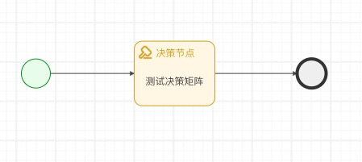
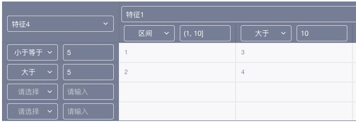
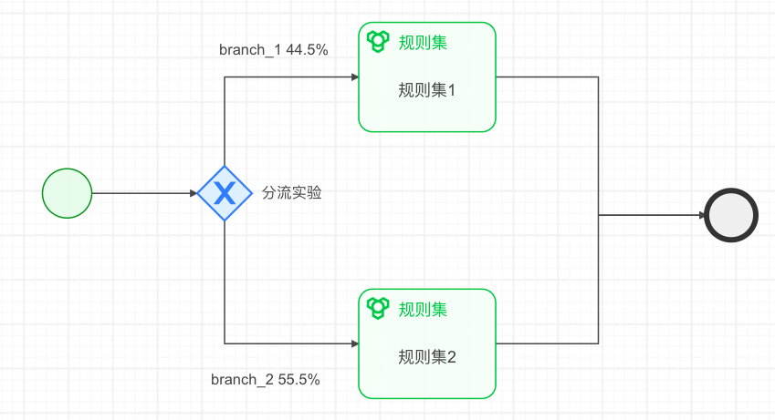
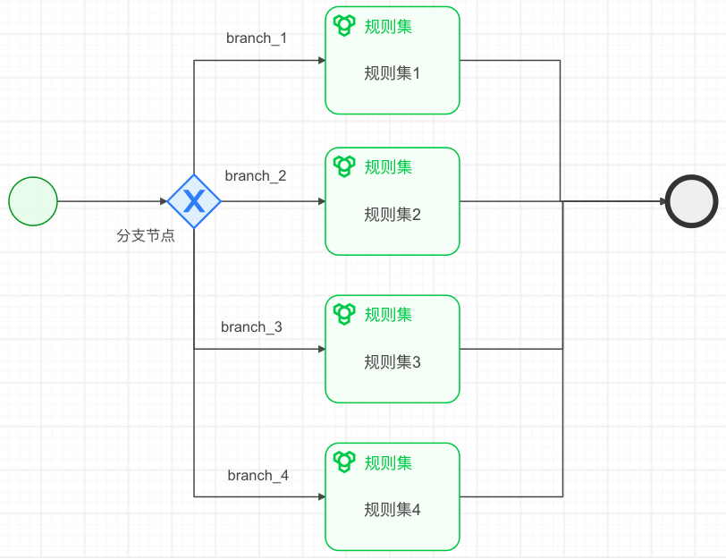

# 实践案例
*目前提供了各类型的决策流用于测试演示案例，统一存放到 demo 目录下，以下是对测试案例的执行过程分析和案例说明*

- [规则集决策流](#规则集决策流)
- [决策矩阵决策流](#决策矩阵决策流)
- [冠军挑战者决策流](#冠军挑战者决策流)
- [条件决策流](#条件决策流)
- [决策树决策流](#决策树决策流)
- [评分卡决策流](#评分卡决策流)
- [各类型特征决策流](#各类型特征决策流)

## 规则集决策流

- yaml 源文件: [demo/flow_ruleset](../demo/flow_ruleset.yaml)
- key: flow_ruleset
- version: 1.0

### 决策流分析：


*CURL*
```shell
curl -XPOST http://localhost:8889/engine/run -d '{"key":"flow_ruleset", "version":"1.0", "req_id":"123456789", "uid":1,"features":{"feature_1":55,"feature_2":true,"feature_3":"a"}}'
```

*执行结果*
```json
{
	"code": 200,
	"error": "",
	"result": {
		"key": "flow_ruleset",
		"req_id": "123456789",
		"uid": 1,
		"features": [{
			"isDefault": false,
			"name": "feature_2",
			"value": true
		}, {
			"isDefault": false,
			"name": "feature_y",
			"value": "yyy"
		}, {
			"isDefault": false,
			"name": "feature_x",
			"value": "xxx"
		}, {
			"isDefault": false,
			"name": "feature_3",
			"value": "a"
		}, {
			"isDefault": false,
			"name": "feature_1",
			"value": 55
		}],
		"tracks": [{
			"index": 1,
			"label": "",
			"name": "start_1"
		}, {
			"index": 2,
			"label": "规则集1",
			"name": "ruleset_1"
		}],
		"hit_rules": [{
			"id": "2",
			"label": "规则2",
			"name": "rule_2"
		}, {
			"id": "1",
			"label": "规则1",
			"name": "rule_1"
		}],
		"node_results": [{
			"IsBlock": true,
			"Kind": "ruleset",
			"Score": 101,
			"Value": "reject",
			"id": 1,
			"label": "规则集1",
			"name": "ruleset_1",
			"tag": "internal"
		}, {
			"IsBlock": false,
			"Kind": "start",
			"Score": 0,
			"Value": null,
			"id": 0,
			"label": "",
			"name": "start_1",
			"tag": ""
		}],
		"start_time": "2022-07-18 21:54:04",
		"end_time": "2022-07-18 21:54:04",
		"run_time": 0
	}
}
```

## 决策矩阵决策流

- yaml 源文件: [demo/flow_matrix](../demo/flow_matrix.yaml)
- key: flow_matrix
- version: 1.0

### 决策流分析：



*CURL*
```shell
curl -XPOST http://localhost:8889/engine/run -d '{"key":"flow_matrix", "version":"1.0", "req_id":"123456789", "uid":1,"features":{"feature_1":20,"feature_4":3}}'
```

*执行结果*
```json
{
	"code": 200,
	"error": "",
	"result": {
		"key": "flow_matrix",
		"req_id": "123456789",
		"uid": 1,
		"features": [{
			"isDefault": false,
			"name": "feature_1",
			"value": 20
		}, {
			"isDefault": false,
			"name": "feature_4",
			"value": 3
		}, {
			"isDefault": false,
			"name": "matrix_1",
			"value": "3"
		}, {
			"isDefault": false,
			"name": "my_matrix_1",
			"value": "3"
		}],
		"tracks": [{
			"index": 1,
			"label": "",
			"name": "start_1"
		}, {
			"index": 2,
			"label": "测试决策矩阵",
			"name": "matrix_1"
		}, {
			"index": 3,
			"label": "",
			"name": "end_1"
		}],
		"hit_rules": [{
			"id": "2",
			"label": "横轴2",
			"name": "rule_2"
		}, {
			"id": "3",
			"label": "纵轴3",
			"name": "rule_3"
		}],
		"node_results": [{
			"IsBlock": false,
			"Kind": "start",
			"Score": 0,
			"Value": null,
			"id": 0,
			"label": "",
			"name": "start_1",
			"tag": ""
		}, {
			"IsBlock": false,
			"Kind": "matrix",
			"Score": 0,
			"Value": "3",
			"id": 1,
			"label": "测试决策矩阵",
			"name": "matrix_1",
			"tag": "my_matrix"
		}, {
			"IsBlock": true,
			"Kind": "end",
			"Score": 0,
			"Value": null,
			"id": 0,
			"label": "",
			"name": "end_1",
			"tag": ""
		}],
		"start_time": "2022-07-18 22:28:20",
		"end_time": "2022-07-18 22:28:20",
		"run_time": 1
	}
}
```

## 决策树决策流

- yaml 源文件: [demo/flow_tree](../demo/flow_tree.yaml)
- key: flow_tree
- version: 1.0

### 决策流分析

*CURL*
```shell
curl -XPOST http://localhost:8889/engine/run -d '{"key":"flow_tree", "version":"1.0", "req_id":"123456789", "uid":1,"features":{"feature_num":-55,"feature_bool":false}}'
```

*执行结果*
```json
{
	"code": 200,
	"error": "",
	"result": {
		"key": "flow_tree",
		"req_id": "123456789",
		"uid": 1,
		"features": [{
			"isDefault": false,
			"name": "feature_bool",
			"value": false
		}, {
			"isDefault": false,
			"name": "feature_num",
			"value": -55
		}, {
			"isDefault": false,
			"name": "tree_1",
			"value": "f"
		}, {
			"isDefault": false,
			"name": "my_tree_feature",
			"value": "f"
		}],
		"tracks": [{
			"index": 1,
			"label": "",
			"name": "start_1"
		}, {
			"index": 2,
			"label": "测试决策树",
			"name": "tree_1"
		}, {
			"index": 3,
			"label": "",
			"name": "end_1"
		}],
		"hit_rules": [],
		"node_results": [{
			"IsBlock": false,
			"Kind": "start",
			"Score": 0,
			"Value": null,
			"id": 0,
			"label": "",
			"name": "start_1",
			"tag": ""
		}, {
			"IsBlock": false,
			"Kind": "tree",
			"Score": 0,
			"Value": "f",
			"id": 1,
			"label": "测试决策树",
			"name": "tree_1",
			"tag": "my_tree"
		}, {
			"IsBlock": true,
			"Kind": "end",
			"Score": 0,
			"Value": null,
			"id": 0,
			"label": "",
			"name": "end_1",
			"tag": ""
		}],
		"start_time": "2022-09-11 16:12:34",
		"end_time": "2022-09-11 16:12:34",
		"run_time": 1
	}
}
```

### 执行结果分析
- 执行节点：开始->测试决策树->结束
- 决策树，从 block_1 开始，feature_bool = false 命中，goto block_3，feature_num < 1 命中，输出结果为 f，结束并赋值。

## 评分卡决策流

- yaml 源文件: [demo/flow_scorecard](../demo/flow_scorecard.yaml)
- key: flow_scorecard
- version: 1.0


*CURL*
```shell
curl -XPOST http://localhost:8889/engine/run -d '{"key":"flow_scorecard", "version":"1.0", "req_id":"123456789", "uid":1,"features":{"num":55.5,"sex":"M", "age": 11}}'
```

*执行结果*
```json
{
	"code": 200,
	"error": "",
	"result": {
		"key": "flow_scorecard",
		"req_id": "123456789",
		"uid": 1,
		"features": [{
			"isDefault": false,
			"name": "num",
			"value": 55.5
		}, {
			"isDefault": false,
			"name": "sex",
			"value": "M"
		}, {
			"isDefault": false,
			"name": "age",
			"value": 11
		}, {
			"isDefault": false,
			"name": "scorecard_1",
			"value": 24
		}, {
			"isDefault": false,
			"name": "my_scorecard",
			"value": 24
		}],
		"tracks": [{
			"index": 1,
			"label": "",
			"name": "start_1"
		}, {
			"index": 2,
			"label": "测试评分卡",
			"name": "scorecard_1"
		}, {
			"index": 3,
			"label": "",
			"name": "end_1"
		}],
		"hit_rules": [],
		"node_results": [{
			"IsBlock": false,
			"Kind": "scorecard",
			"Score": 24,
			"Value": 24,
			"id": 1,
			"label": "测试评分卡",
			"name": "scorecard_1",
			"tag": "my_scorecard"
		}, {
			"IsBlock": true,
			"Kind": "end",
			"Score": 0,
			"Value": null,
			"id": 0,
			"label": "",
			"name": "end_1",
			"tag": ""
		}, {
			"IsBlock": false,
			"Kind": "start",
			"Score": 0,
			"Value": null,
			"id": 0,
			"label": "",
			"name": "start_1",
			"tag": ""
		}],
		"start_time": "2022-10-01 16:32:35",
		"end_time": "2022-10-01 16:32:35",
		"run_time": 1
	}
}
```
### 执行结果分析
- 执行节点：开始->测试评分卡->结束
- 评分卡: num(55.5) BETWEEN [50,100] 分值为 4 ，sex = M 分值为 10，age(11) < 18 分值为 10，sum 加和后为 24。


## 冠军挑战者决策流

- yaml 源文件: [demo/flow_abtest](../demo/flow_abtest.yaml)
- key: flow_abtest
- version: 1.0

### 决策流分析


*CURL*
```shell
curl -XPOST http://localhost:8889/engine/run -d '{"key":"flow_abtest", "version":"1.0", "req_id":"123456", "uid":3,"features":{"feature_1":20,"feature_3":"aaa","feature_4":4}}'
```

*执行结果*
```json
{
	"code": 200,
	"error": "",
	"result": {
		"key": "flow_abtest",
		"req_id": "123456",
		"uid": 3,
		"features": [{
			"isDefault": false,
			"name": "feature_1",
			"value": 20
		}, {
			"isDefault": false,
			"name": "feature_3",
			"value": "aaa"
		}, {
			"isDefault": false,
			"name": "feature_4",
			"value": 4
		}],
		"tracks": [{
			"index": 1,
			"label": "",
			"name": "start_1"
		}, {
			"index": 2,
			"label": "分流实验",
			"name": "abtest_1"
		}, {
			"index": 3,
			"label": "规则集1",
			"name": "ruleset_1"
		}, {
			"index": 4,
			"label": "",
			"name": "end_1"
		}],
		"hit_rules": [],
		"node_results": [{
			"IsBlock": true,
			"Kind": "end",
			"Score": 0,
			"Value": null,
			"id": 0,
			"label": "",
			"name": "end_1",
			"tag": ""
		}, {
			"IsBlock": false,
			"Kind": "start",
			"Score": 0,
			"Value": null,
			"id": 0,
			"label": "",
			"name": "start_1",
			"tag": ""
		}, {
			"IsBlock": false,
			"Kind": "abtest",
			"Score": 0,
			"Value": 30.010551178761848,
			"id": 11,
			"label": "分流实验",
			"name": "abtest_1",
			"tag": "tag_ab"
		}, {
			"IsBlock": false,
			"Kind": "ruleset",
			"Score": 0,
			"Value": null,
			"id": 1,
			"label": "规则集1",
			"name": "ruleset_1",
			"tag": "internal"
		}],
		"start_time": "2022-07-18 22:24:33",
		"end_time": "2022-07-18 22:24:33",
		"run_time": 1
	}
}
```

## 条件决策流

- yaml 源文件: [demo/flow_conditional](../demo/flow_conditional.yaml)
- key: flow_conditional
- version: 1.0

### 决策流分析


*CURL*
```shell
curl -XPOST http://localhost:8889/engine/run -d '{"key":"flow_conditional", "version":"1.0", "req_id":"123456789", "uid":1,"features":{"feature_1":20,"feature_3":"xyzab","feature_4":55,"feature_5":44,"feature_6":"a","feature_a":false,"feature_b":1}}'
```

*执行结果*
```json
{
	"code": 200,
	"error": "",
	"result": {
		"key": "flow_conditional",
		"req_id": "123456789",
		"uid": 1,
		"features": [{
			"isDefault": false,
			"name": "feature_4",
			"value": 55
		}, {
			"isDefault": false,
			"name": "feature_5",
			"value": 44
		}, {
			"isDefault": false,
			"name": "feature_6",
			"value": "a"
		}, {
			"isDefault": false,
			"name": "feature_a",
			"value": false
		}, {
			"isDefault": false,
			"name": "feature_b",
			"value": 1
		}, {
			"isDefault": false,
			"name": "feature_1",
			"value": 20
		}, {
			"isDefault": false,
			"name": "feature_3",
			"value": "xyzab"
		}],
		"tracks": [{
			"index": 1,
			"label": "",
			"name": "start_1"
		}, {
			"index": 2,
			"label": "分支节点",
			"name": "conditional_1"
		}, {
			"index": 3,
			"label": "规则集3",
			"name": "ruleset_3"
		}, {
			"index": 4,
			"label": "",
			"name": "end_1"
		}],
		"hit_rules": [{
			"id": "5",
			"label": "规则5",
			"name": "rule_5"
		}],
		"node_results": [{
			"IsBlock": true,
			"Kind": "end",
			"Score": 0,
			"Value": null,
			"id": 0,
			"label": "",
			"name": "end_1",
			"tag": ""
		}, {
			"IsBlock": false,
			"Kind": "start",
			"Score": 0,
			"Value": null,
			"id": 0,
			"label": "",
			"name": "start_1",
			"tag": ""
		}, {
			"IsBlock": false,
			"Kind": "conditional",
			"Score": 0,
			"Value": "branch_3",
			"id": 1,
			"label": "分支节点",
			"name": "conditional_1",
			"tag": "ab"
		}, {
			"IsBlock": false,
			"Kind": "ruleset",
			"Score": 1,
			"Value": "record",
			"id": 3,
			"label": "规则集3",
			"name": "ruleset_3",
			"tag": "internal"
		}],
		"start_time": "2022-07-18 22:04:11",
		"end_time": "2022-07-18 22:04:11",
		"run_time": 1
	}
}
```

### 执行结果分析
- 执行节点：开始->分支节点->规则集3（第三个分支）->结束
- 分支节点根据命中条件不同会进入 1-4 不同分支，由于 feature_a = false && feature_b <= 100 命中进入分支3，分支3对应规则集3。规则集3 （feature_3 LIKE xyz）命中，记录不阻塞流程。最后结束。


## 各类型特征决策流

- yaml 源文件: [demo/flow_multifeature](../demo/flow_multifeature.yaml)
- key: flow_multifeature
- version: 1.0

### 决策流分析
这里决策流用于展示各种数据类型的特征，每种特征支持不同的操作符类型。


*CURL*
```shell
curl -XPOST http://localhost:8889/engine/run -d '{"key":"flow_multifeature", "version":"1.0", "req_id":"123456789", "uid":1,"features":{"num_feature":55,"str_feature":"hello_test","bool_feature":false, "date_feature": "2022-08-29 23:59:59", "array_feature":[1, 3], "map_feature": {"key": "x"}}}'
```

*执行结果*
```json
{
	"code": 200,
	"error": "",
	"result": {
		"key": "flow_multifeature",
		"req_id": "123456789",
		"uid": 1,
		"features": [{
			"isDefault": false,
			"name": "num_feature",
			"value": 55
		}, {
			"isDefault": false,
			"name": "str_feature",
			"value": "hello_test"
		}, {
			"isDefault": false,
			"name": "bool_feature",
			"value": false
		}, {
			"isDefault": false,
			"name": "date_feature",
			"value": "2022-08-29T23:59:59Z"
		}, {
			"isDefault": false,
			"name": "array_feature",
			"value": [1, 3]
		}, {
			"isDefault": false,
			"name": "map_feature",
			"value": {
				"key": "x"
			}
		}],
		"tracks": [{
			"index": 1,
			"label": "",
			"name": "start_1"
		}, {
			"index": 2,
			"label": "规则集",
			"name": "ruleset_1"
		}, {
			"index": 3,
			"label": "",
			"name": "end_1"
		}],
		"hit_rules": [{
			"id": "4",
			"label": "日期规则",
			"name": "date_rule"
		}, {
			"id": "5",
			"label": "数组规则",
			"name": "array_rule"
		}, {
			"id": "6",
			"label": "字典规则",
			"name": "map_rule"
		}, {
			"id": "1",
			"label": "数值规则",
			"name": "num_rule"
		}, {
			"id": "2",
			"label": "字符串规则",
			"name": "str_rule"
		}, {
			"id": "3",
			"label": "布尔规则",
			"name": "bool_rule"
		}],
		"node_results": [{
			"IsBlock": false,
			"Kind": "start",
			"Score": 0,
			"Value": null,
			"id": 0,
			"label": "",
			"name": "start_1",
			"tag": ""
		}, {
			"IsBlock": false,
			"Kind": "ruleset",
			"Score": 6,
			"Value": "record",
			"id": 1,
			"label": "规则集",
			"name": "ruleset_1",
			"tag": "internal"
		}, {
			"IsBlock": true,
			"Kind": "end",
			"Score": 0,
			"Value": null,
			"id": 0,
			"label": "",
			"name": "end_1",
			"tag": ""
		}],
		"start_time": "2022-09-07 13:47:03",
		"end_time": "2022-09-07 13:47:03",
		"run_time": 1
	}
}
```

### 执行结果分析
- 执行流程：开始->规则集->结束，其中规则集包含 5 条规则
- 数字规则: num_feature > 50 （num_feature = 55） 命中
- 字符串规则：str_feature LIKE test （str_feature = hello_test） 命中
- 布尔规则：bool_feature = false  (bool_feature = false)  命中
- 日期规则：date_feature BEFORE 2022-08-30  （date_feature = 2022-08-29 23:59:59） 命中
- 数组规则：array_feature IN [1, 3, 5, 7, 9]  （array_feature = [1, 3]） 命中
- 字典规则：map_feature VALUEEXIST x  （map_feature = {"key": "x"}）  命中

